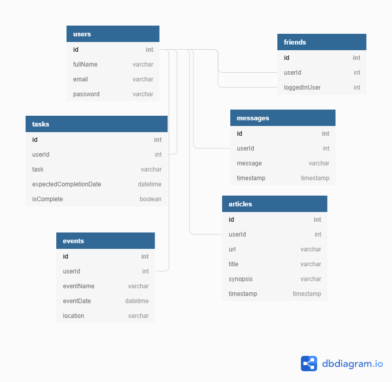

# Nutshell: The Information Dashboard

## Installation

1. Download this repository
1. `cd` into the directory it creates
1. In the `api` directory, create a copy of the `database.json.example` and remove the .example extension.
1. Run `npm install` and wait for all dependencies to be installed
1. Run `npm start` to verify that installation was successful.

## Instructions

Nutshell is a dashboard for people to use to organize their daily tasks, events, news article, friends, and chat messages.

1. In your browser, navigate to `http://localhost:8080/`
1. If you are a new user, please Register a new account
1. If you are a returning user, please Login
1. After this, you will be taken to the main Nutshell dashboard
1. If there are other users that have registered on the same computer, you will be able to see what they have added to their Dashboard once you Friend/Follow them
1. Things to try:
 - Add other users as your Friends to see their upcoming Events and Articles they've shared
 - Add your upcoming Events for other users to see
 - Add recent Articles you'd like to share with your Friend group (sharing is caring)
 - Add items to your personal To-Do list and mark them as complete when you've completed them (GO YOU!)
 - Send new chat messages in the public Messages board (be considerate!)
 - Have fun!

## ERD

&copy; 2019 - Chase Fite, Ken Boyd, Guy Cherkesky, Sullivan Pierce, & Ryan Bishop